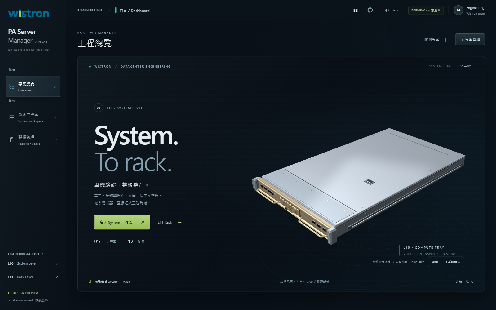

# PA Server Manager Next

High-end desktop UI concept for Wistron PA Server Manager, designed around two distinct engineering levels:

- **L10 — System Level:** system projects, OS/BMC health, terminals, hardware inventory, sensors, firmware, telemetry and test tasks.
- **L11 — Rack Level:** 48U placement, rack components, topology, rack-wide operations and component telemetry.

## Current status

This repository is an **independent interactive design preview**. It preserves the existing frontend workflows with local fixture data, but it is not connected to production equipment or the original FastAPI service yet. Terminal, KVM, power, scan and AI actions are safe simulations.

The original `pa-server-manager` repository is not modified by this project.

## Run locally

Python 3 is sufficient; no package installation is required.

```powershell
python serve.py
```

Open <http://127.0.0.1:8769/> in a desktop browser. Use `python serve.py --port 8770` to choose another port.

## Design

- Official transparent Wistron website logo asset
- Distinct **Pearl Light / Graphite Dark** themes, anchored in Wistron blue and green
- Original native WebGL Compute Tray / NVL72-inspired rack, with reversible scroll-driven assembly
- Drag to inspect all sides; arrow keys rotate, Home resets, and scrolling gently restores the narrative camera
- Reduced-motion layout keeps both management entries available and permits explicit user-controlled rotation
- Dedicated L10 and L11 project workspaces
- Rebuilt five-tab system detail workspace
- System identity and CPU / memory / storage / NIC / GPU summaries come from reported inventory, not an assumed GPU product
- 48U rack, topology, component composition and telemetry views

See [DESIGN-NOTES.md](DESIGN-NOTES.md) for scope, source attribution, validation and known limitations.

## Desktop acceptance

This redesign lives on `astra-cinematic-ui`, separate from `main`.

With the server running, use `node qa/acceptance.cjs`. The test runner uses Playwright and Chrome for development testing only; the application adds no runtime dependencies. Set `PLAYWRIGHT_MODULE` and `CHROME_PATH` if required by your environment. Results and screenshots are generated in `qa/artifacts/`.

Additional dependency-free checks: `node qa/hardware-identity.cjs --unit`, `node qa/theme-contract.cjs`, `node qa/theme-palette.cjs`, `node qa/story-adapter.cjs`, and `node qa/core-scene.cjs`. The supplementary browser suite is `node qa/appearance-interaction.cjs`; consult [the validation notes](DESIGN-NOTES.md#validation) for which checks were actually executed.

Direct routes: `/#/dashboard`, `/#/projects/fleet_l`, `/#/machine/host_a`, `/#/rack/proj_k`.

State demonstrations: `/?preview=empty#/projects`, `/?preview=loading#/machine/host_a`, and `/?preview=error#/machine/host_a` (retry recovers).

## Desktop preview



[Rack transition](qa/artifacts/dashboard-rack-stage-1600.png) · [System Detail](qa/artifacts/system-detail-1600.png) · [Rack Workspace](qa/artifacts/rack-workspace-1600.png) · [Acceptance results](qa/artifacts/acceptance.md)

## Safety

All included addresses use documentation IP ranges. Fixture credentials are preview-only strings. The local preview server binds to loopback and blocks `/api/` and `/ws/` network routes.
