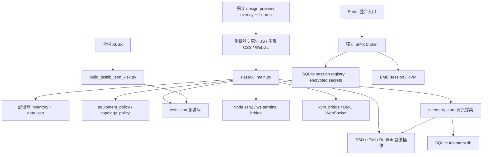

# PA Server Manager Next — 完整 Repository Review

日期：2026-09-28。基準：`9f3ac044f4aed0fcccc906e712dd4defd4e77657`，本機 HEAD 與 origin/main 相同。

方法：主審查整合 API／資料模型／測試庫；獨立 reviewer A 檢查前端／3D／UX，reviewer B 檢查 Telemetry／Terminal／KVM／broker。A 在設計提案推送後重新檢查 proposal；主審查以 Chrome 開啟 repository 內的新版預覽，確認首頁深淺色、Rack 材質及異常清單互動。

這是原始碼、隔離重現及 fixture UI 的審查，不是正式環境滲透測試、效能基準或每條 testcase 的內容認證。本輪沒有修改應用程式碼、連線設備、啟動正式 FastAPI、執行電源操作或部署。前一階段已推送的是設計文件與獨立原型；本報告沒有推送。

## 核心判斷

目前產品已具備完整的工程工具輪廓：L10/L11、設備能力分類、機櫃配置、WebGL、終端機、KVM、Telemetry、測試庫及 AI 診斷都有實作。值得優先補強的是 **信任邊界、狀態正確性、連線生命週期與資料契約**。此時全面更換前端框架、拆成大量微服務或先增加 3D 特效，都不是最高效益的投資。

新版設計已改善資訊層級、完整異常清單、Ping 用語、功能字級與窄版 CSS。保留 Wistron 藍綠方向及現有金屬／石墨／CDU 材質是合理選擇。接下來應統一「狀態的來源、時間及範圍」，而不只是再調顏色。

## 目前架構

SP-X broker 是獨立的可選整合，不能把它已有的 RBAC／ticket 保護當成 main API／Node bridge 都已獲得同樣保護。design-preview 是比較用原型，不能把它當作已接正式資料的產品入口。

## 1. Frontend architecture

**現況。** `app.js` 有 4,786 行，負責共享狀態、路由、API、原始 renderer 與多種操作。`product`、`cinematic`、`equipment-workspace`、`engineering-ux`、`operations-ux`、`workspace-ux` 等依固定順序包裝／替換函式。入口載入 12 個第一方 CSS 檔，樣式依 cascade 與多處 `!important` 決定。[載入順序][frontend-load]

**F12｜P2：功能與畫面結構之間有隱性耦合。** 多個 wrapper 先把前一層產生的 HTML 解析成 DOM，依 class/querySelector 改寫，再序列化回字串。底層 class 或 HTML 結構改動，可能使後續改寫默默失效。重複工作主要是 renderer 包裝、搜尋／分頁重繪、狀態判斷及 theme overrides，而非單純「有很多檔案」。這是可維護性風險；未量測其實際毫秒成本。

**建議。** 保留現有 UI，先建立明確的 view-model、狀態 selector、API client 和元件 render/update 介面；按設備清單、Rack、detail 逐頁收斂 wrapper。將工程場景 renderer 與頁面 DOM 生命週期分開。原型 overlay 適合設計比較，不建議整包追加成下一層正式 monkey patch。

## 2. Backend architecture

**現況。** `main.py` 有 3,866 行，同時處理 inventory、機櫃規則、SSH/IPMI、快取、AI、測試庫、HTTP 與 WebSocket；已有 `equipment_policy.py`、`topology_policy.py`、`telemetry_core.py` 等有價值的分離。

**F11｜P2：單行程記憶體與全檔 JSON 持久化限制擴充。** `_data_transaction` 在全域 RLock 下 deepcopy 所有資料；每次寫入序列化整個 inventory。鎖僅保護同一行程，不能直接藉增加 uvicorn workers 擴充。更值得先修的是 transaction 涵蓋外部 I/O：例如 change-os-ip 會等待 Ping／SSH，而部分 edit 回傳 `_bmc_safe()` 又會 Ping，其他寫入因而等待同一把鎖。[transaction][storage]、[IP 變更][change-ip]

**優點。** 唯一暫存檔、flush/fsync、atomic replace、失敗 rollback 已實作，不能再把歷史版本「存檔失敗仍成功」列為現在的缺陷。

**建議。** 先將遠端探測移到鎖外，以 revision/expected target 在短交易內確認後提交；抽出 inventory repository、device operations、telemetry service 與 API routers。當多人協作／多 worker 需求確立時，再導入有交易與 migration 的資料庫。第一階段不需要微服務。

## 3. API design

**F08｜P1：專用流程的防護可由一般 PATCH 繞過。** `/rack-specification` 對 L10→L11 要求完整 expected snapshot，但一般 `/api/machines/{name}` 同時接受 `level/project/rack_size`，可直接完成升級，不要求那些 stale-state 欄位。隔離呼叫已確認此路徑。它仍會驗證 U 位／碰撞；問題是專用流程的前置條件並非所有入口共同遵守。[一般編輯][edit]、[專用規格 API][spec]

**F09｜P1：舊 `/api/links` 契約無法可靠識別多條線。** 新增未確認端點存在及 type 合法性；刪除只依無向 `{a,b}` 找第一筆，不看 port/type。兩台設備同時有 Ethernet 與電源連線時，要求刪電源可能刪到另一條；刪除機台也不清理這些 links。三個行為均以合成資料重現。[links API][links]、[設備刪除][delete-machine]

**其他契約債。** `/machine` 與 `/machines` 並存；許多 mutation 直接使用 `dict`，欄位／型別／錯誤行為不一致；部分失敗是 HTTP 200 + `ok:false`，其他使用 HTTPException；`expected_target` 對電源動作仍可省略；耗時的掃描、分析與控制缺少一致的 job id、取消與 idempotency 模型。[操作契約][operations]

**建議。** 建立 typed request/response models、統一錯誤結構、mutation revision、操作 job 與 audit id；以穩定 device/project/link ID 作關聯，名稱維持顯示欄位。先兼容舊 API 再遷移，不只為了命名美觀破壞既有客戶端。

## 4. Telemetry

**F04｜P1：持續過熱告警會被誤清除。** 既有 active key 命中後直接 continue，沒有刷新觀測時間；後面的 stale 清理又依原始 `ts` 清除。預設窗口下，持續超標約 8 分鐘後也可能轉成 clear，下一轮再建立告警。隔離測試以最新 95°C、門檻 88°C、600 秒前的 active alert 確认被標 clear。[告警狀態][alerts]

**F05｜P1：AI 文字生成可能延長 SQLite 寫入交易。** 同輪兩個以上新告警時，第一次 INSERT 後下一次 `_alert_llm()` 仍在未提交交易內，單次可等待 30 秒。其他採集 writers 因而競爭寫鎖。隔離重現兩次 LLM 呼叫的 `in_transaction` 為 `[False, True]`。[告警迴圈][alerts]

**架構限制。** worker 是「整批做完，再 sleep 15 秒」，不是保證每 15 秒準點採集；慢設備會增加整輪延遲。16 workers 與 subprocess timeout 已有上限，但缺少每設備退避、採集延遲／失敗原因／資料新鮮度的統一監控。[worker][worker]

**建議。** 告警先用 deterministic rule 產生，分開 created_at、last_seen_at、resolved_at；LLM 建議作可缺省的異步補充。UI 回傳 source、observed_at、freshness、error class，不把無資料當成 0 或正常。為 collector 加 timeout budget、失敗退避與採樣品質指標。

**功能缺口。** switch/PDU/power shelf/CDU/storage/network 的 `collect_rack()` 仍是明示 stub，回空而不連設備；這是待整合功能，不是已有真實 Telemetry。[collector 範圍][collector]。現有 rack 每設備每分鐘聚合及 contributors 防止同分鐘重複樣本被放大，應保留。

## 5. L10/L11 architecture

**優點。** 設備類型與 capability 已共用規則，L10/L11 不要求每台都有 GPU。既有 L11 一般移動保留高度／類型；前後面共享物理占位；外置 CDU 0U、內置 CDU 底部位置及唯一性有驗證；新版 topology 有 revision 與 port/link validation。[設備規則][equipment]、[topology][topology]

**F13｜P2：尚未形成單一完整的設備／安裝／節點模型。** `level`、`mgx_type`、project、rack placement、OS slots、top-level active OS/BMC、project topology 是數套相連表示法。topology 有獨立 device/node/port IDs，但 inventory reference 仍為文字，且原有 global links 另成一套資料。變更與刪除容易留下不同步關聯；F08/F09 是已確認的具體例子。

**建議。** 分清 Project、Rack、Equipment、Node、ManagementEndpoint、Installation、Port、Link；設備身份不隨名稱或所在層級改變。保留 current OS→paired BMC 規則與既有相容欄位，以 adapter 漸進遷移。將「待上櫃」「外置」「已上櫃」建模為不同安裝狀態，不用 `rack_u=0` 推論全部語意。

## 6. WebGL / 3D rack

**F14｜P2：Rack Ping 後重建場景，打斷檢視。** Ping 完成呼叫 `setView('rack')`；equipment wrapper dispose/remount scene，初始化新的 camera/yaw/zoom/focus。選取设备有恢復，但正在聚焦、旋轉的視角不是同一個 scene 狀態，還會重新建立 WebGL resources。[Ping 完成][rack-ping]、[場景掛載][scene-mount]。這是 source path 確認，未以 GPU profiler 量測成本。

**優點。** 已有 DPR／renderbuffer 上限、visibility 與 reduced-motion 控制、context loss/restoration、observer/listener/buffer 清理，以及 48U／鍵盤替代操作。沒有依據把整套 renderer 說成普遍記憶體洩漏。[場景保護][scene]

**建議。** 將 status/selection 更新和 geometry rebuild 分開；保留 camera state；只在安裝配置真的改變時重建幾何。補「連續 Ping、切頁、context restore」的資源／視角回歸，再依實測決定是否需要 instancing 或 LOD。保留現有材質與工程模型，不改成一般 SaaS 圖卡。

## 7. Test library

**目前資料。** `data/tests.json` 約 5.91 MB；3,112 列、2,977 個 unique codes，125 個 code 有多列。124 個重複 code 的 procedure/criteria 不完全相同，100 個的 command text 不完全相同。合併 workbook 的列數、unique code 數及 YES/PARTIAL/NO 分布與 JSON 相同；未逐格或逐項驗證全部內容。多列可能是合法 test variants，不能直接刪重。

**F10｜P1：variant identity 在選取與 AI 建議間不一致。** UI 以 code 作 selection key，選一列會收集同 code 所有列；確認畫面會列出多筆，這是已有保護。但 AI advice API 只找第一筆同 code，沒有 sheet/variant ID，可能將另一個 variant 的 procedure/criteria 當成分析依據。[UI 選取][test-select]、[AI advice][test-advice]

**F16｜P2：建置與使用契約缺少可追溯版本。** 新 builder 從合併 XLSX 建置，但舊 README 仍介紹依賴 `/root/test-library` 的 CSV overlay workflow；新 builder 預設輸出指向 `/srv/pa-manager-prod/data/tests.json`。輸出 `generated_at` 為 null，沒有 source hash/schema version；前端 sheet cache 又沒有版本失效規則。`UNRESOLVED` 在 API meta 會歸入 NO，無法區分未審與明確不可執行。[builder][builder]、[舊 README][library-readme]、[meta][test-meta]

**建議。** 新增 stable case_variant_id，保留 code 作 group；AI 建議明確選 variant。建置輸出包含來源 checksum、schema version、review revision、row/unique counts 與驗證摘要。預設先產生本地 artifact，再明確發布。保留現在「產生文字，不直接執行 testcase」的界線；若未來加 runner，先設計風險／package／target／evidence 契約。

## 8. Terminal / KVM

**F06｜P1：Node bridge 有兩個可重現的失敗路徑。** 無效 URL percent escape 使 `decodeURIComponent` 的 URIError 離開 connection listener，可能終止整個 bridge。廣播只保存 shell stream，沒有管理所有 SSH Client；WebSocket 在 SSH ready 前關閉，晚到的 callback 仍可開 shell，Client 未 end。隔離 mock 已重現，沒有真實 socket。[Terminal 入口][terminal]、[broadcast cleanup][broadcast]

**F07｜P1：SP-X session lifecycle 不完整。** registry 的 active lookup 不排除 expires_at 已過資料；broker 只要有 QSESSIONID 就 touch 重用。sweeper 有定義但 app lifespan 沒有啟動；同 user、不同 Portal session 又可建立超過設定 cap 的 session。隔離測試確定 expired session 仍被回傳、cap1 可產生 2 個 active sessions。[registry][registry]、[broker reuse][broker-reuse]、[lifespan][broker-life]

**F07b｜P1：broker 的 async launch 直接呼叫同步網路登入／secret 解密。** 單 worker 下，慢 BMC 或解密可阻塞其他 launch／health 等 request；轉入 bounded worker 或 async transport 時，須同時提供 per-BMC serialization，避免新 race。[broker launch][broker-launch]

**F07c｜P2：KVM basecode 探測會登入但丟棄 session。** 多次探測／開關 KVM 時，部分 adapter 沒有配對 logout，WebSocket close 不等於 BMC web session logout。可能累積 BMC session；實際設備 session 上限與自動到期未驗證。[KVM 探測][kvm-detect]

**建議。** 統一 connection session 擁有權：connecting/active/closing/closed，Client、stream、cookie/session resource 一併清理；設定 target 去重、fan-out 上限、single-use ticket、expiry 與重連策略。保留 broker 原本 fail-closed auth、allowlist、一次性 launch ID、target/subdomain 綁定及 audit 架構。

## 9. Performance

已确认的是能產生延遲的路徑，不是「實際可支援幾千台」的容量結論：

- **F05：** SQLite 寫鎖可能跨越多次 LLM 網路等待。
- **F07b：** async broker 被同步 I/O 阻塞。
- **F11：** 全 inventory transaction 含 Ping／SSH，且整份資料 deepcopy/write。
- **F14：** status-only Ping 更新造成 WebGL 整體重建。
- **F15｜P2：** `force_scan=true` 直接 `_refresh_status()`，跳過一般背景 scan lock；多個強制請求可重複全量探測。各 Rack/topology Ping request 又各自建立 pool，缺少全服務共享的探測併發 budget。[scan][scan]
- **F15b｜P2：** 所有 static response 都設 `no-cache, no-store`，重訪也無法善用已下載的 JS/CSS/vendor assets。以 fingerprinted immutable assets 搭配需重新驗證的 HTML，可避免為防舊版 cache 而放棄全部快取。[static cache][static-cache]

建議先量測 API P50/P95、event-loop delay、collector duration/lag、SQLite busy 次數、每設備 SSH 併發、Rack render/資源重建次數，再訂 50/200/1,000 設備的合成測試規模。測試量級是建議，不是本輪已驗證的容量。

## 10. Maintainability / 工程測試

**F17｜P2：測試資產多，但整合防線尚不完整。** 現有 qa 能隔離實際函式，覆蓋 rollback、OS/BMC 同步、Rack occupancy、placement 與部分非同步 UI lifecycle；這是明確優點。但不少 backend regression 透過 AST 擷取函式並替換 dependencies，不能證明實際 FastAPI route／Pydantic validation／middleware／lifespan 都正確接線。

本 checkout 沒有 `.github/workflows`；不能據此斷言外部 CI 不存在，但 repo 本身未提供可重現的 CI gate。此環境没有 pytest，既有 broker/parser pytest suite 未完成；`requirements.txt` 沒有完整開發測試環境清單。Node bridge 已有 lockfile，不能稱全部依賴都未鎖版。`PROJECT_STATUS.md:217` 記錄既存 theme-contract CSS-order 失敗，應納入已知 baseline 管理。

**建議。** 保留快速純函式測試，再加入可注入 temporary repository/device adapters 的真實 ASGI integration suite；將上述重現變成 regressions。建立一致的 unit/integration/browser 命令、dev dependencies、fixture contract、CI artifact 與失敗基準。整理 README／skill 中過時的原 repo、部署路徑、測試庫來源，避免新人照舊流程操作。

## 11. Security

**F01｜P1：已儲存憑證可被送到呼叫者指定的主機。** Terminal query 可覆寫 host，同時以既有機台補回 password；隔離原始 Node handler 已確認。main `/probe-bmc` 同樣接受提交的 `os_ip` 卻從 machine_name 取儲存帳密，先 SSH 登入才驗 hostname。因此事後 hostname 比對不能避免登入時先把密碼送錯地方。[Terminal 憑證組合][terminal]、[probe][probe]

修正方向：inventory 連線模式的 target/user/port/credential 必須綁成同一個授權 snapshot；手動 target 不得自動借用別台 stored secret。新 IP enrollment 必須有身份驗證與授權流程，而非只因 Ping/hostname 相符就信任。

**F02｜P1：main API 與 Node bridge 缺少 repository 內可見的統一存取邊界。** main 的 CORS 是 `*`，未見 request authentication／role/target scope 檢查；Node WebSocket 也缺 auth／Origin 驗證，預設綁 0.0.0.0。general PATCH 可寫 custom power/aux command，操作 endpoint 以 `shell=True` 在管理主機執行。自訂指令是既有功能，但必須限制為可信管理者；前端確認框不是 API authorization。[main app][auth]、[custom command][commands]、[Node listener][terminal]

未檢查實際 reverse proxy、防火牆或 SSO，因此**沒有確認外網暴露或實際遭入侵**。若外部已有保護，仍應防止繞過 proxy 直達 bridge，並落實設備與操作層級授權。不要將 broker 的 NoAuthPortal 誤認為放行：它預設拒絕，這是優點。

**F03｜P1：秘密資料與 inventory／Git 未充分分離。** git-tracked `data.json` 存在 10 個非空 credential fields；本輪只輸出計數，未在報告列出值，也未驗證是否為現役憑證。`.gitignore` 不會移除已追蹤檔案。正常 `_save_data()` 也會將機台 credential 欄位寫入 JSON。[持久化][storage]

建議確認这些值是否真實／仍有效；若是，先撤換，再規劃 repository/history 處理。應以 sanitized sample 取代實際 inventory，credential 改存 secret reference，由受控 secret store 管理。刪檔或加 ignore 並不代表 Git 歷史中的值已失效。未在本輪擅自輪換或改寫歷史。

**F03b｜P1：設備身份驗證普遍被停用。** SSH 設 `StrictHostKeyChecking=no`／忽略 known_hosts；BMC HTTPS/WSS 多處關閉 verification，Node SSH 未提供 host verifier。加密不能取代遠端身份確認。以 SSH fingerprint、BMC CA／證書 pin 與明確 enrollment 改善；因舊 BMC 相容性，這項變更風險較高，應分批導入。[SSH][ssh]、[KVM transport][kvm-tls]

本輪沒有依版本號推定 CVE，沒有執行完整 dependency advisory／Git history secret scan；不能宣稱已通過安全認證。

## 12. UX/UI — 以新版提案為準

**已在設計改善，不再當成新提案缺陷：** 首頁「系統架構總覽」、完整且可搜尋的異常 queue、Ping 三態與圖例、主要／選取／警告層級、部分 12px 操作標籤、窄版搜尋/pills CSS。Chrome 已確認新版首頁深淺色與 Rack 保留原工程材質。[提案][proposal]、[提案樣式][proposal-css]

**F18｜P2：新版提案仍需細修。**

- **已在 Chrome 重現：** 輸入無結果搜尋，再點「Ping 未回應 3／查看完整清單」，query 未清掉，畫面仍是 0 台。全域完整清單入口應清除搜尋或明確顯示篩選限制；一般 tab 可維持原搜尋。
- 「全部設備」目前只計算有 OS/BMC IP 且非擋板的設備；fixture 顯示 top total 48、tab 44。這不是算術錯誤，但集合名稱不明，無 IP 的主動設備也不在 queue 中。可改為「已設定 IP 的設備」並另列「待設定」。
- source 顯示 L11 的 `rack_u=0` 全被寫成「櫃外」，未區分待上櫃與外置 CDU；BMC-only 設備的 IP 欄卻只呈現 os_ip，會顯示破折號。應以 installation/management endpoint 語意呈現。
- 專案卡已把「運作正常」改為「OS Ping 可達」，但專案 issue count 仍只看 OS，與新 queue 的 OS/BMC 條件不同。
- Rack 新圖例分三態，但舊 3D 燈號仍合併「未檢查／未設 IP」，Inspector 又同時顯示設備快取與本次 Rack Ping。Chrome 可見两種觀測並列，應標示各自來源與時間，避免看似矛盾。

**F19｜P2：新增設備表單的 accessible name 仍未補齊。** 原有 modal label 與 password reveal 控制在兩個模式都沿用，proposal 沒有修復；新首頁搜尋有正確 label 不代表全站已修好。[表單][form]

**整合工作。** Proposal 沒有改變正式 `static/` 的 scene lifecycle 或狀態計算，這些仍是待實作。實作時將可重用 tokens／status component 併入既有系統，保留 3D 材質；不要再疊一層永久文字替換。新版窄版 CSS 已有改善，但本次續審未重新量測特定 390/320px；先前約 394px 的抽查只能作先前證據。

## 改善排序：Impact / Risk / Effort

Impact 指問題不處理的影響與改善價值；Risk 指**實作這項修正的回歸／遷移風險**，不是漏洞嚴重度。Effort 是單位工作粗估：S 約 0.5–2 人日，M 約 3–5 人日，L 約 1–3 人週，XL 超過 3 人週。包含 focused tests；不含 SSO 採購／組織審批、實機維護窗口和大規模資料遷移。各項可能共享基礎建設，不能直接加總。

| 順序 | 改善項目 | Impact | Risk | Effort | 完成判準 |
|---|---|---|---|---|---|
| 1 | F01：target 與 stored secret 綁定，禁止混用 | 極高 | 中 | M | 指定不同 host 無法使用其他設備 secret；正規 inventory/manual 連線仍可用 |
| 2 | F02：main／bridge auth、角色／設備授權與自訂指令權限 | 極高 | 中高 | L | 直接 API/WS、跨設備、低權限和 custom command 都有拒絕測試及 audit |
| 3 | F03：確認 Git 憑證有效性、撤換有效值、分離 secret | 極高（若為現役） | 中高 | M–L | sanitized fixtures；部署與 Git 不再共用明文 secret；舊值撤銷有確認 |
| 4 | F04/F05：告警不誤解除、LLM 離開 DB 交易 | 高 | 低中 | M | 持續超標不 clear；LLM timeout 不阻擋 metrics 寫入 |
| 5 | F06：Terminal malformed URL 與 close-before-ready | 高 | 低中 | M | 壞連線不終止 bridge；關閉後 client/stream 都歸零 |
| 6 | F07：broker expiry/cap/sweeper/async 與 KVM logout | 高 | 中 | L | 過期 cookie 不重用；跨 browser cap 有效；慢 BMC 不堵其他 request |
| 7 | F08/F09：補齊 L10/L11 mutation 契約與 link identity | 高 | 中 | M | 所有入口均遵守相同 transition；指定線路精確刪除；無 dangling refs |
| 8 | F10：test variant identity 與 AI advice 一致 | 高 | 中 | M | 同 code 多 variant 可明確選取，advice 使用精確對應的 criteria |
| 9 | F03b：SSH/BMC 身份驗證與 enrollment | 高 | 高 | L | 未知／變更 fingerprint 被拒；舊設備相容例外可追蹤 |
| 10 | F11/F15：縮短 inventory 鎖、限制全局探測 budget | 中高 | 中 | L | 慢設備不長期阻塞 inventory mutation；重複掃描可合併 |
| 11 | F18/F19：proposal 細修、表單 labels、狀態來源統一 | 中高 | 低中 | M | 完整入口不受隱藏 query 影響；狀態與範圍可辨；控制皆有名稱 |
| 12 | F14：status-only scene update、保留 camera | 中 | 中 | M | Ping 後視角／焦點保持，無不必要的 geometry/buffer rebuild |
| 13 | F16/F17：建置來源版本、測試環境與 CI gate | 中高 | 低中 | M–L | fresh checkout 可離線建置與測試；artifact 有來源 hash；安全重現列為 gate |
| 14 | F12/F13：漸進模組化與統一 domain model | 長期高 | 高 | XL | 每次拆分保留 API/行為相容；資料模型 migration 可驗證與回復 |
| 15 | F15b：靜態資產 cache 與按需載入 | 中 | 低中 | S–M | 新版立即可用，重訪能重用 fingerprinted assets |
| 16 | 非 server collectors、操作 jobs、跨層證據追蹤 | 依業務高 | 高 | L–XL | 依實際廠牌／型號驗證；每筆量測與操作有來源、目標、時間與證據 |

上述是實施先後關係，不代表所有人都要串行工作。身份驗證規劃進行時，可並行修告警／Terminal 小缺陷与低風險 UI；模組化和新功能應等關鍵契約測試就位。

## 建議新增的能力

1. **統一異常工作清單。** 接通 Ping、collector failure、stale telemetry、health event；按 project/equipment/interface 篩選，保留來源與時間，再加入 ack／指派／處理紀錄。先修現有告警 correctness 再擴充。
2. **可追蹤操作 jobs。** 顯示 accepted/running/partially failed/completed/cancelled；關聯穩定 target snapshot、權限、操作者、結果與 correlation id。重試不應默默重送高影響硬體動作。
3. **設備連線設定與 enrollment。** 分開 SSH、IPMI、Redfish、KVM 端點及 port，讓憑證、身份驗證、最近成功／失敗原因可理解。
4. **Test library variant 與執行證據關聯。** 由具體 case variant 追蹤來源版本、package 前提、風險、目標與 logs。先維持文字產生模式，runner 是後續獨立功能。
5. **廠牌／型號 collector adapters。** 按實際需求優先 PDU/power shelf、switch、CDU；提供 units、sampling quality、freshness 與能力宣告。3D 流向示意保持與實測值清楚分開。

## 驗證紀錄與限制

| 項目 | 結果／範圍 |
|---|---|
| Git 基準 | HEAD/origin/main 同為 9f3ac044；與初審 0bb60acc 相比，應用程式、測試與 scripts 原始碼未變，只有設計文件／獨立預覽新增 |
| Python qa | `python -B -m unittest discover -s qa -p '*regression.py'`：81 項通過，9.726 秒；隔離資料／mock，不啟動 main.app |
| Node qa | `qa/operations_regression.cjs`、`qa/equipment_regression.cjs` 通過；非真實設備整合 |
| 新的 backend 合成檢查 | 一般 PATCH 可無 expected snapshot 升級；舊 links 接受無效端點/type、刪除忽略 port/type、刪機台留下 links，均重現 |
| Terminal 合成檢查 | 指定 host 混用既有 password、malformed path URIError、close-before-ready 孤兒 shell 均重現；HTTP/WS/SSH/fs 被 mock |
| Broker／告警合成檢查 | expired-active、同 user 跨 browser 超 cap、持續過熱被 clear、LLM 在寫交易內呼叫均重現；SQLite memory-only |
| Test library | workbook/JSON metadata 統計；未執行測試命令，未逐項審查 2,977 個 unique code |
| 最新 Chrome | 從 versioned preview server 8887 開啟；看過首頁深／淺、Rack，重現完整清單搜尋保留；合成資料 |
| 未完成項 | pytest suite（環境未安裝）、完整 ASGI/security integration、實際 SSO/proxy/firewall、實機 Telemetry/KVM、容量/網路/GPU profiling、全站 contrast／screen-reader／多尺寸完整驗證 |

本報告採用 Impeccable 的 Operate／資訊層級／語意與既有 critique 作 UX 依據；不是重新執行完整雙獨立設計評分／detector certification。舊 28/40 與 detector 21 records 是原始介面的歷史結果，未套用成新版分數。

[frontend-load]: https://github.com/wistroneq3300/pa-server-manager-next/blob/9f3ac044/static/index.html#L278
[storage]: https://github.com/wistroneq3300/pa-server-manager-next/blob/9f3ac044/main.py#L110
[change-ip]: https://github.com/wistroneq3300/pa-server-manager-next/blob/9f3ac044/main.py#L919
[edit]: https://github.com/wistroneq3300/pa-server-manager-next/blob/9f3ac044/main.py#L731
[spec]: https://github.com/wistroneq3300/pa-server-manager-next/blob/9f3ac044/main.py#L803
[links]: https://github.com/wistroneq3300/pa-server-manager-next/blob/9f3ac044/main.py#L2021
[delete-machine]: https://github.com/wistroneq3300/pa-server-manager-next/blob/9f3ac044/main.py#L1427
[operations]: https://github.com/wistroneq3300/pa-server-manager-next/blob/9f3ac044/main.py#L2057
[alerts]: https://github.com/wistroneq3300/pa-server-manager-next/blob/9f3ac044/telemetry_core.py#L347
[worker]: https://github.com/wistroneq3300/pa-server-manager-next/blob/9f3ac044/telemetry_core.py#L723
[collector]: https://github.com/wistroneq3300/pa-server-manager-next/blob/9f3ac044/telemetry_core.py#L706
[equipment]: https://github.com/wistroneq3300/pa-server-manager-next/blob/9f3ac044/equipment_policy.py#L12
[topology]: https://github.com/wistroneq3300/pa-server-manager-next/blob/9f3ac044/topology_policy.py#L8
[rack-ping]: https://github.com/wistroneq3300/pa-server-manager-next/blob/9f3ac044/static/js/app.js#L466
[scene-mount]: https://github.com/wistroneq3300/pa-server-manager-next/blob/9f3ac044/static/js/equipment-workspace.js#L252
[scene]: https://github.com/wistroneq3300/pa-server-manager-next/blob/9f3ac044/static/js/rack-equipment-scene.js#L615
[test-select]: https://github.com/wistroneq3300/pa-server-manager-next/blob/9f3ac044/static/js/app.js#L3231
[test-advice]: https://github.com/wistroneq3300/pa-server-manager-next/blob/9f3ac044/main.py#L1581
[builder]: https://github.com/wistroneq3300/pa-server-manager-next/blob/9f3ac044/scripts/build_testlib_json_xlsx.py#L24
[library-readme]: https://github.com/wistroneq3300/pa-server-manager-next/blob/9f3ac044/README.md#L415
[test-meta]: https://github.com/wistroneq3300/pa-server-manager-next/blob/9f3ac044/main.py#L1470
[terminal]: https://github.com/wistroneq3300/pa-server-manager-next/blob/9f3ac044/terminal_bridge/server.js#L70
[broadcast]: https://github.com/wistroneq3300/pa-server-manager-next/blob/9f3ac044/terminal_bridge/server.js#L249
[registry]: https://github.com/wistroneq3300/pa-server-manager-next/blob/9f3ac044/spx_kvm_broker/registry.py#L156
[broker-reuse]: https://github.com/wistroneq3300/pa-server-manager-next/blob/9f3ac044/spx_kvm_broker/broker.py#L222
[broker-life]: https://github.com/wistroneq3300/pa-server-manager-next/blob/9f3ac044/spx_kvm_broker/app.py#L69
[broker-launch]: https://github.com/wistroneq3300/pa-server-manager-next/blob/9f3ac044/spx_kvm_broker/broker.py#L132
[kvm-detect]: https://github.com/wistroneq3300/pa-server-manager-next/blob/9f3ac044/kvm_bridge.py#L298
[scan]: https://github.com/wistroneq3300/pa-server-manager-next/blob/9f3ac044/main.py#L1384
[static-cache]: https://github.com/wistroneq3300/pa-server-manager-next/blob/9f3ac044/main.py#L3849
[probe]: https://github.com/wistroneq3300/pa-server-manager-next/blob/9f3ac044/main.py#L657
[auth]: https://github.com/wistroneq3300/pa-server-manager-next/blob/9f3ac044/main.py#L43
[commands]: https://github.com/wistroneq3300/pa-server-manager-next/blob/9f3ac044/main.py#L372
[ssh]: https://github.com/wistroneq3300/pa-server-manager-next/blob/9f3ac044/main.py#L266
[kvm-tls]: https://github.com/wistroneq3300/pa-server-manager-next/blob/9f3ac044/kvm_bridge.py#L43
[proposal]: https://github.com/wistroneq3300/pa-server-manager-next/blob/9f3ac044/docs/design-preview/proposal.js#L11
[proposal-css]: https://github.com/wistroneq3300/pa-server-manager-next/blob/9f3ac044/docs/design-preview/proposal.css#L22
[form]: https://github.com/wistroneq3300/pa-server-manager-next/blob/9f3ac044/static/index.html#L129
